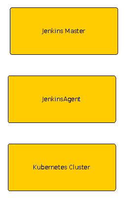

# Part 9: Three-tier CI/CD Pipeline

During my long break, I've been taking a course on Ansible. I used AWS to set up several EC2 instances and implemented a CI/CD pipeline which involved the use of Ansible to deploy a docker container to a production environment. I'm getting near the end of the course and now we are setting up a Kubernetes cluster. The only problem is, I don't want to set up Route53. 

This weekend, I realized I had an extra machine that might be useful in setting up a home lab environment. After some set up, including an upgrade from Ubuntu 16.x to 18.x, I now have 2 Ubuntu boxes sharing the same desktop (literally) as my ArchLinux box. Seems like a good substitue to using the cloud! 

In this project, I plan to implement a 3 tier CI/CD pipeline. There are three machines involved. The first, my main desktop running ArchLinux, will run minikube as it's been working fine and is the most critical component. The second machine will run Jenkins, while the third machine will run a Jenkins node and will be responsible for building docker images and uploading it to github.



# First step: provision hosts

While my ArchLinux development box aleady had docker and minikube, the other boxes did not. I decided that the best way to handle privisioning at scale was using Ansible, but didn't know if there already was a module that could install docker. After doing some research, I found that other people developed playbooks for this purpose, but no module seemed to be existant. https://www.digitalocean.com/community/tutorials/ how-to-use-ansible-to-install-and-set-up-docker-on-ubuntu-18-04 was the closest thing, but I wasn't sure how much I could trust it. 

Enter Vagrant. After provisioning a Vagrant image using https://app.vagrantup.com/ubuntu/boxes/bionic64, I logged in and proceeded to follow the official instructions to install docker on Ubuntu at https://docs.docker.com/engine/install/ubuntu. The steps I followed were:

```bash
sudo apt-get update
sudo apt-get install -y \
    apt-transport-https \
    ca-certificates \
    curl \
    gnupg-agent \
    software-properties-common
 curl -fsSL https://download.docker.com/linux/ubuntu/gpg | sudo apt-key add -
 sudo add-apt-repository \
   "deb [arch=amd64] https://download.docker.com/linux/ubuntu \
   $(lsb_release -cs) \
   stable"
sudo apt-get update
sudo apt-get install -y docker-ce docker-ce-cli containerd.io
```

Additional steps are needed for a non-root account to use docker.

```bash
sudo usermod -aG docker your-user
```

Afterwards I was able to run docker as user vagrant.

```bash
docker run hello-world
```

Next, I then implemented an Ansible playbook to automate the steps. Looking at https://docs.ansible.com/ansible/latest/collections/ansible/builtin/index.html#plugins-in-ansible-builtin, I saw three modules of interest: *apt*, *apt_key* and *apt_repository*. The playbook is as follows:

```bash
---
- hosts: zaxserver, milkshake
  become: true 
  tasks:
    - name: Install required packages
      apt: name={{ item }} state=latest update_cache=yes
      loop: [ 'apt-transport-https', 'ca-certificates', 'curl', 'gnupg-agent', 'software-properties-common' ]
   
    - name: Add docker GPG key
      apt_key:
         url: https://download.docker.com/linux/ubuntu/gpg 
         state: present
    
    - name: Add docker repository
      apt_repository:
         repo: https://download.docker.com/linux/ubuntu bionic stable
         state: present
   
    - name: Update apt and install docker-ce
      apt: name={{ item }} state=latest update_cache=yes
      loop: [ 'docker-ce', 'docker-ce-cli', 'containerd.io' ]

    - name: All non-root account to use docker
      command: usermod -aG docker taro
```

After running this playbook, I was able to confirm that docker was indeed installed on both hosts.

```bash
[taro@zaxman ansible (master)]$ ansible zaxserver,milkshake  -a "docker --version"
milkshake | CHANGED | rc=0 >>
Docker version 19.03.13, build 4484c46d9d
...
zaxserver | CHANGED | rc=0 >>
Docker version 19.03.13, build 4484c46d9d
```

Afterwards I shut both servers down. End of day 1.

```bash
ansible zaxserver,milkshake  --become -a "poweroff"
```

## Second step: Setup Jenkins master and node

My next step was to setup Jenkins. As an initial step, I created a simple pipeline script to demonstrate that I could invoke commands on a remote ndoe. 

* SSH to machine #2
* Clone https://github.com/tarof429/jenkins
* Use a browser to access the Jenkins UI and install recommended plugins
* SSH to the container and set up password-less SSH connections between the container and machine #2
* Add a Jenkins node for machine #3, which as a reminder will build images and upload them to dockerhub.
* Ran jenkins_hello_world pipeline script to confirm that the master could talk to the node.

The jenkins_hello_world pipeline script is shown below:

```bash
pipeline {
    agent none 
    stages {
        stage('Say Hello') {
            agent { label 'milkshake' } 
            steps {
               sh 'echo hello world!'
            }
        }
    }
}
```

## Next step: Create build pipeline to build and push docker image

Now I was ready to implement the real pipeline script. As a reminder, machine #2 is where Jenkins master is running and we want machine #3 to do the actual build. It will checkout the code from github, login to dockerhub, then run the deployment script. The deployment script builds the image, pushes it to dockerhub, then uses ansible to interact with machine #1 (my Archlinux host) and creates a deployment on minikube. 

After I developed the pipeline script and confirmed that the deployment worked, I encountered an interesting problem related to databases. Before I developed the pipeline, I manually ran a script to create the secrets.yaml file that would be deployed to kubernetes. However in an automated process there is no place for user intervention. The secrets.yaml file would need to be created automatically and morever, the passwords in it need to be exactly the same as in my development environment.

I made several attempts to resolve this issue, but in the end I decided that this pipeline is not for production and it's okay to store it in a script. I copied my exisiting script that prompted for the passwords and committed it to git. This would be run automatically by the Jenkins pipeline so that the secrets.yaml would be generated on the fly, and it would match the same secrets.yaml file in my development environment. At this point, I know this isn't going to work for a production environment, but at least I've sovled one problem.

The next problem again involved databases. How do I add a new row in the database? I quickly tried to research this, but in the end I got frustrated and wasn't able to create a new record. However I was able to add a new REST method, commit it to git, and confirm that the new method showed up in my deployment. At least the pipeline works. Below is my successful call for this method, which I called `n`, to get the name of an actor in the database. 

```bash
$ curl "http://10.108.19.218:6000/n/Serinda%20Swan"
"[{\"name\": \"Serinda Swan\", \"movie_name\": \"Siren #2\"}]"
```

And as a reminder to myself, this IP is actually the IP of my LoadBalancer, which is being exposed and is accessible to me after I run `minikube tunnel`. It is NOT the IP of minikube itself. Also another note to myself, queries which include spaces must be denoted with `%20`. 

## Closing thoughts

This was definitely an adventure. I never thought that developing a CI/CD pipeline for Kubernetes would be this complicated! If I was developing this for production, I'd need to do more investigation about the database password issue. There needs to be some way to secure the password in a way that I don't have to absolutely hard-code it in a file. Maybe this can be done by creating a ansible task? Then I could run a script locally to generate the secrets file and push it out to production at will. Only after that's done, I could run the deployment. I really didn't expect Ansible to be so important in CI/CD. I've tagged this version as https://github.com/tarof429/tron_legacy_cast/tree/v1.3. 

I found a book that seems to hit smack on the topics I explored in this section: https://www.packtpub.com/product/continuous-delivery-with-docker-and-jenkins-second-edition/9781838552183. It may be a good resource. Although it looks like a very good resource, I'm surprised that there are very few reviews of the book. 