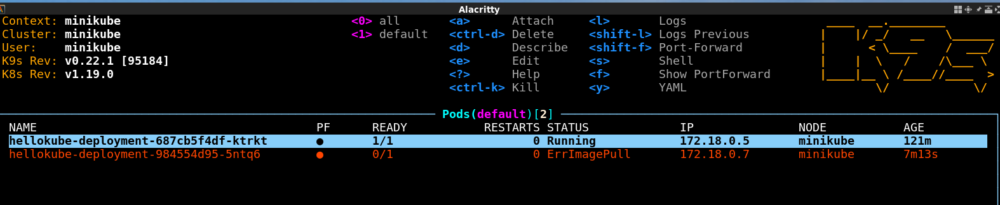

# Part 4: Visualizing the Cluster

Up to this point, I've used the Kubernetes plugin for Visual Studio as a convenient way to manage my cluster. But it's lacking in visualization. That is, I'm unable to see how the ingress controller talks to my service.

That's when I stumbled upon https://github.com/spekt8/spekt8. 

## Spekt8

To install, I just used Kubenetes.

```bash
$ kubectl apply -f https://raw.githubusercontent.com/spekt8/spekt8/master/spekt8-deployment.yaml
```

I ran `kubectl get deployments` and saw spekt8 hasd been created, but not avaiable. I ran this several times but, as I got the same result, ran `kubectl get pods` and saw that the container was still being created. I think this goes to show that it can take some time for new deployments to become usable.

```bash
$ kubectl get pods
NAME                                    READY   STATUS              RESTARTS   AGE
hellokube-deployment-687cb5f4df-ktrkt   1/1     Running             0          31m
spekt8-698b57f56d-bpvzm                 0/1     ContainerCreating   0          18s
```

According to https://github.com/spekt8/spekt8, we have to run one additional command to make this deployment available to my browser. So before I ran `kubectl port-forward deployment/spekt8 3000:3000` I tried accessing http://localhost:3000/ and got nothing. What does this command do? I found that it's actually explained when I run kubectl --help. Maybe it's something simpler than the NGINX controller?

```bash
...
Troubleshooting and Debugging Commands:
  describe      Show details of a specific resource or group of resources
  logs          Print the logs for a container in a pod
  attach        Attach to a running container
  exec          Execute a command in a container
  port-forward  Forward one or more local ports to a pod
  proxy         Run a proxy to the Kubernetes API server
  cp            Copy files and directories to and from containers.
  auth          Inspect authorization
...
```

So I ran the command as instructed and the command blocked.

```bash
$ kubectl port-forward deployment/spekt8 3000:3000
Forwarding from 127.0.0.1:3000 -> 3000
Forwarding from [::1]:3000 -> 3000
```

However in my browser I could not see any pods when I accessed http://localhost:3000.

The in the README I saw a note saying that I needed to set RBAC authorization for spekt8 to gather information about pods. So I ran a command as instructed.

```bash
$ kubectl apply -f https://raw.githubusercontent.com/spekt8/spekt8/master/fabric8-rbac.yaml
```

But still nothing.

## minikube dashboard

That's when I remembered that minikube itself had a dashboard. So I ran `minikube dashboard` and went to my browser and presto! There was my dashboard.

I actually think VS Code's plugin is better, but it's usable. It is possible to SSH into containers and delete them just as I can with the VS Code plugin. 

## k9s

k9s is a console-based tool for Kubernetes. The github page at https://github.com/derailed/k9s describes several ways to install it, but after having issues running it as a docker container, intalled the package. Running it couldn't be any more simpler that typing `k9s`. It immediately detected my hellokube deployment running in minikube. Navigation was a little confusing at first. 

To test how well it works, I modified my deployment to pick up a non-existing image `hellokubex:v1.0`. k9s immediately updated the status, then showed that Kubernetes was unable to pull the image. I like how the status is updated so dynamically; it's something that's lacking in the plugin for Visual Studio.

It does use quite a lot of screen real estate, so it's clear that it was intended for a full screen. By typing `s` I was able to SSH into my container.



I'm sure there are other console tools worth investigating, but I'm quite pleased with k9s!